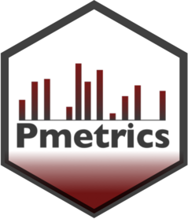

<!-- README.md is generated from README.Rmd. Please edit that file -->

```{r, include = FALSE}
knitr::opts_chunk$set(
  collapse = TRUE,
  comment = "#>",
  fig.path = "man/figures/README-",
  out.width = "100%"
)
```

# PmetricsData <a href="https://lapkb.github.io/Pmetrics/"></a>

<!-- badges: start -->
<!-- badges: end -->

PmetricsData provides datasets and examples which can be used with the Pmetrics pharmacometric modeling and simulation package. They can also be used in other relevant packages or applications.

Included are the following. Further details are included in the help for each data item, e.g. `?NPex`.

### Pharmacokinetic data

* NPex - Output of a *nonparametric* model fit in a  [PM_result](https://lapkb.github.io/Pmetrics/reference/PM_result.html).
* ITex - Output of a *parametric* model fit in a  [PM_result](https://lapkb.github.io/Pmetrics/reference/PM_result.html).
* modEx - Model for absorption into central compartment in a  [PM_model](https://lapkb.github.io/Pmetrics/reference/PM_model.html).
* model - The saved text file version of `modEx`.
* dataEx - Data based on oral rifapentine with frequent sampling in 20 adults, all formatted as  [PM_data](https://lapkb.github.io/Pmetrics/reference/PM_data.html).
* badData - Example of data with errors to show catch/highlight functions
* simEx - Simulation output using `NPex` and the first 4 subjects in a  [PM_sim](https://lapkb.github.io/Pmetrics/reference/PM_sim.html).


### Other Data

* mic1 - Data frame with vancomycin minimum inhibitory concentration (MIC) and counts for methicillin-resistant *Staphylococccus aureus* (MRSA) obtained from EUCAST.
* growth - Data on height and weight percentiles by age and sex, from CDC. Can be used in the Pmetrics [qgrowth](https://lapkb.github.io/Pmetrics/reference/qgrowth.html) function.
* cdc_bmi, ger_bmi - Age and sex-specific BMI z-scores and percentiles from CDC or NHANES. Can be used in the Pmetrics [zbmi](https://lapkb.github.io/Pmetrics/reference/zBMI.html) function.
* locales - World languages and their iso693 two- and three-letter codes. Pmetrics uses these data to assist with location detection and proper date, decimal, and number separator formatting.


## Installation

You can install the development version of PmetricsData from [GitHub](https://github.com/) with:

``` r
# install.packages("devtools")
devtools::install_github("LAPKB/PmetricsData")
```

## Example

This is a basic example which shows you how to solve a common problem:

```{r example}
library(PmetricsData)
## basic example code
NPex

```

What is special about using `README.Rmd` instead of just `README.md`? You can include R chunks like so:

```{r cars}
summary(cars)
```

You'll still need to render `README.Rmd` regularly, to keep `README.md` up-to-date. `devtools::build_readme()` is handy for this.

You can also embed plots, for example:

```{r pressure, echo = FALSE}
plot(pressure)
```

In that case, don't forget to commit and push the resulting figure files, so they display on GitHub and CRAN.
